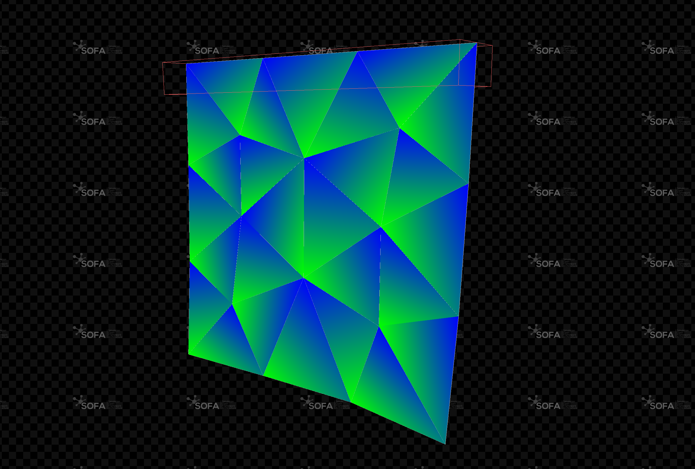

# Shell

This plugin for [SOFA](https://github.com/sofa-framework/sofa) implements mechanical models following the Shell method.

## AUTHORS 
 - Thomas Golembiovsky
 - Christian Duriez
 - Olivier Comas
 - Igor Peterlik
 - Stéphane Cotin

## LICENCE 
 - LGPL
